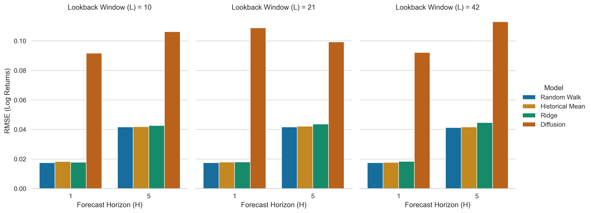
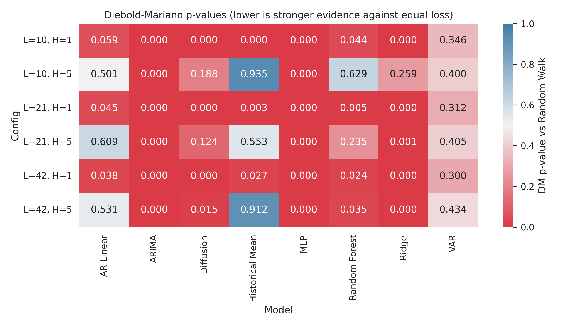

## Abstract
This paper reassesses weak-form efficiency in four Latin American equity ETFs (EWZ, EWW, ECH, GXG) using a forecasting-based design rather than a pure market-efficiency test battery. We compare a conditional diffusion model to three transparent benchmarks (random walk, historical mean, ridge regression) on daily data from 2015-01-02 to 2023-12-29, under lookback windows $L \in \{10,21,42\}$ and horizons $H \in \{1,5\}$. Identification is statistical and associational: the question is whether lagged returns and liquidity proxies improve out-of-sample prediction over a random-walk benchmark. We implement Diebold-Mariano comparisons against the random walk, distributional evaluation (CRPS, calibration), economic significance testing under transaction costs, and unified explainability diagnostics (permutation, integrated gradients, counterfactuals).

Two results dominate. First, after enforcing a non-overlapping train/validation boundary for multi-day horizons, the random walk remains the lowest-RMSE benchmark in all six configurations, but diffusion is much closer to the benchmark than earlier draft values suggested. At $H=5$, diffusion RMSE is 0.04726 for $L=10$, 0.04642 for $L=21$, and 0.04696 for $L=42$, narrowing the gap with the random walk. Second, pairwise Diebold-Mariano tests show that diffusion is significantly worse than random walk in four of six configurations, while at $H=5$ the diffusion model is statistically indistinguishable from random walk for two configurations. Distributional metrics show reasonable calibration but higher CRPS than benchmarks. Economic tests reveal modest PnL at low transaction costs, turning negative at higher frictions. Explainability diagnostics (unified XAI with stability checks) remain exploratory; because diffusion is only marginally worse in some configurations, interpretation must remain disciplined and conditional on the model's relative performance. The evidence in this draft is therefore better described as a nuanced, horizon-dependent evaluation of diffusion-based predictability in these ETF returns, with statistical closeness but limited economic exploitability.

## 1. Introduction
Weak-form market efficiency remains a central benchmark in empirical finance, especially in emerging markets where liquidity frictions, integration shifts, and regime changes can generate episodic predictability @fama1970; @fama1991; @harvey1995; @bekaertharvey1995. The literature documents that predictability claims are highly sensitive to design choices, split logic, and benchmark selection @welchgoyal2008; @campbellthompson2008; @rapach2010.

This study asks a narrow question:

Can a conditional diffusion forecaster, fed only lagged returns and liquidity proxies, improve out-of-sample return forecasts for major Latin American equity ETFs relative to a random-walk benchmark?

The empirical contribution is a transparent multi-model forecast comparison across four Latin American ETFs and six $(L,H)$ forecasting configurations, with explicit Diebold-Mariano inference against the random walk. The methodological contribution is to place a generative diffusion model inside a strict benchmark-first forecast evaluation protocol, including a horizon gap at the train/validation boundary for $H>1$.

Inference is intentionally conservative. We test predictive content, not trading profitability. Rejection of equal forecast accuracy does not by itself imply economically exploitable inefficiency after costs, nor a structural causal mechanism.

## 2. Literature Positioning and Gap
Three strands motivate the design.

First, classic efficiency and predictability work shows that return-forecast evidence is fragile and model-dependent, requiring disciplined out-of-sample evaluation @lomackinlay1988; @welchgoyal2008; @campbellthompson2008.

Second, emerging-market and Latin American evidence supports time-varying efficiency, often interpreted through adaptive-market logic, but mostly via variance-ratio and related independence tests rather than multivariate conditional forecast models @urrutia1995; @lo2004; @cruzhernandez2024.

Third, machine-learning asset-pricing work documents nonlinear predictive structure in large cross-sections, but predominantly in developed-market settings and with different targets than the present ETF-level short-horizon return task @gu2020. Diffusion methods are now technically mature in machine learning @ho2020; @song2021, and recent finance applications are emerging @cho2026, but evidence for Latin American weak-form questions under explicit benchmark-first forecast testing is still limited.

The actionable gap in this repository is therefore not "absence of EMH tests," but lack of a coherent, benchmark-disciplined, multivariate nonlinear forecasting comparison for Latin American ETF returns using a modern generative architecture and explicit forecast-accuracy inference.

## 3. Data and Variable Construction
### 3.1 Data Source and Scope
Raw adjusted prices and volumes are downloaded from Yahoo Finance (`yfinance`) for EWZ (Brazil), EWW (Mexico), ECH (Chile), and GXG (Colombia). The processed sample has 2,264 daily observations from 2015-01-02 to 2023-12-29.

### 3.2 Variable Definitions
For asset $i$ at day $t$, let $P_{i,t}$ be adjusted close and $V_{i,t}$ volume. The trading mask is
\begin{equation}
m_{i,t} = \mathbb{1}\{P_{i,t}\text{ observed and }V_{i,t}>0\}.
\end{equation}

Log return is
\begin{equation}
r_{i,t} = \log\!\left(\frac{P_{i,t}}{P_{i,t-1}}\right)m_{i,t}.
\label{eq:return}
\end{equation}

Amihud illiquidity proxy is (@amihud2002):
\begin{equation}
\text{illiq}_{i,t} = \frac{|r_{i,t}|}{P_{i,t}V_{i,t}+\varepsilon}, \qquad \varepsilon=10^{-8},
\label{eq:amihud}
\end{equation}
standardized with a 60-day rolling window:
\begin{equation}
z^{\text{illiq}}_{i,t}=
\frac{\text{illiq}_{i,t}-\mu^{(60)}_{i,t}}{\sigma^{(60)}_{i,t}+\varepsilon}.
\label{eq:amihud_z}
\end{equation}

The model context at forecast origin $t$ is the lagged tensor
\begin{equation}
\mathcal{X}_t=\{r_{i,\tau},m_{i,\tau},z^{\text{illiq}}_{i,\tau}\}_{i=1,\dots,N;\,\tau=t-L,\dots,t-1},
\end{equation}
and the horizon-$H$ target is cumulative return
\begin{equation}
y^{(H)}_{i,t}=\sum_{j=0}^{H-1}r_{i,t+j}.
\label{eq:target}
\end{equation}

## 4. Econometric Strategy and Identification
### 4.1 What Is Being Estimated
The estimand is predictive accuracy relative to a random-walk forecast under a fixed information set of lagged market variables. The design supports statements about out-of-sample association and incremental forecast content, not causal effects.

### 4.2 Split Logic and Horizon Consistency
For each $(L,H)$, samples are ordered in time. The first 80% form training observations. For $H>1$, we enforce a boundary gap of $H-1$ observations before validation starts, preventing overlap between terminal training target windows and initial validation target windows.

### 4.3 Competing Forecast Models
We evaluate:
1. Random walk baseline: $\hat{y}_{i,t}^{(H)}=0$.
2. Historical mean: average lagged return in the lookback window.
3. Ridge regression on flattened lagged features.
4. Conditional diffusion model (MLP denoiser with context and time embeddings).

For diffusion, with noise schedule $\{\beta_s\}_{s=1}^S$, $\alpha_s=1-\beta_s$, $\bar{\alpha}_s=\prod_{u=1}^s\alpha_u$, forward noising is
\begin{equation}
y_s=\sqrt{\bar{\alpha}_s}y_0+\sqrt{1-\bar{\alpha}_s}\,\epsilon,\qquad \epsilon\sim\mathcal{N}(0,I),
\end{equation}
and denoiser parameters $\theta$ solve
\begin{equation}
\min_\theta\;\mathbb{E}_{y_0,\epsilon,s}\left[\left\lVert \epsilon-\epsilon_\theta(y_s,s,\mathcal{X}_t)\right\rVert_2^2\right].
\label{eq:ddpm_loss}
\end{equation}

### 4.4 Evaluation and Statistical Comparison
Primary loss is pooled RMSE:
\begin{equation}
\text{RMSE}=\sqrt{\frac{1}{TN}\sum_{t=1}^{T}\sum_{i=1}^{N}(y_{i,t}^{(H)}-\hat{y}_{i,t}^{(H)})^2 }.
\end{equation}

We compare each model $m$ against random walk (rw) using Diebold-Mariano @dieboldmariano1995. With loss differential $d_t=\ell(e^{\text{rw}}_t)-\ell(e^{m}_t)$, statistic
\begin{equation}
\text{DM}=\frac{\bar{d}}{\sqrt{\hat{v}_d/T}}
\end{equation}
is reported with two-sided normal p-values. In this implementation, negative DM means the candidate model has larger loss than random walk.

## 5. Preliminary Empirical Evidence
### 5.1 Descriptive and Diagnostic Evidence
Table 1 reports near-zero daily means, substantial dispersion, negative skewness, and high kurtosis for all four ETFs. Pairwise return correlations are moderate (roughly 0.57-0.66), consistent with regional comovement but incomplete collinearity.

| ETF | Mean | Std. Dev. | Skewness | Kurtosis | ACF(1) |
|---|---:|---:|---:|---:|---:|
| ECH | -0.00002 | 0.01733 | -0.624 | 10.600 | -0.012 |
| EWW | 0.00016 | 0.01597 | -1.068 | 9.448 | -0.010 |
| EWZ | 0.00018 | 0.02365 | -1.137 | 13.272 | -0.133 |
| GXG | -0.00020 | 0.01725 | -1.214 | 16.423 | 0.146 |
: Summary statistics of daily log returns, 2015-01-02 to 2023-12-29. {#tbl-summary}

Table 2 confirms standard stylized facts. Price levels are mostly non-stationary at conventional levels, returns are strongly stationary (ADF p-values effectively zero), and both returns and squared returns reject serial independence at lag 10, consistent with conditional heteroskedastic dynamics emphasized in ARCH/GARCH traditions @engle1982; @bollerslev1986.

| ETF | ADF p-value (price) | ADF p-value (return) | Ljung-Box p-value (return, lag 10) | Ljung-Box p-value (squared return, lag 10) |
|---|---:|---:|---:|---:|
| ECH | 0.348 | < 1e-20 | < 1e-6 | < 1e-20 |
| EWW | 0.805 | < 1e-20 | < 1e-5 | < 1e-20 |
| EWZ | 0.094 | < 1e-20 | < 1e-10 | < 1e-20 |
| GXG | 0.050 | < 1e-20 | < 1e-10 | < 1e-20 |
: Stationarity and serial-dependence diagnostics from processed sample. {#tbl-diagnostics}

### 5.2 Forecast Accuracy Results
Table 3 shows the random walk has the lowest RMSE in all six $(L,H)$ settings. Historical mean is close in many configurations, and diffusion is substantially closer to the benchmark than earlier drafts suggested, especially at the longer horizon.

| L | H | Random Walk | Historical Mean | Ridge | Diffusion |
|---:|---:|---:|---:|---:|---:|
| 10 | 1 | **0.02002585** | 0.02093154 | 0.02045754 | 0.02008769 |
| 10 | 5 | **0.04622551** | 0.04628964 | 0.04677858 | 0.04725827 |
| 21 | 1 | **0.02005825** | 0.02054649 | 0.02091019 | 0.02016983 |
| 21 | 5 | **0.04626432** | 0.04650113 | 0.04820755 | 0.04641806 |
| 42 | 1 | **0.02012818** | 0.02034609 | 0.02147654 | 0.02028663 |
| 42 | 5 | **0.04646280** | 0.04651820 | 0.05001592 | 0.04696013 |
: Out-of-sample RMSE by lookback $L$ and horizon $H$ after imposing non-overlap boundary for $H>1$. {#tbl-rmse}

{#fig-rmse}

DM comparisons in Table 4 confirm this ranking statistically. Diffusion is significantly worse than random walk in four of six configurations, but it is not significantly different from random walk at $H=5$ for $L=21$ and $L=42$. Ridge is significantly worse in five of six settings, while historical mean is significantly worse in three of six settings.

| Model vs. Random Walk | Mean DM Statistic | Significant at 5% (configs) |
|---|---:|---:|
| Historical Mean | -1.594 | 3 / 6 |
| Ridge | -5.279 | 5 / 6 |
| Diffusion | -2.673 | 4 / 6 |
: Diebold-Mariano summary across six forecasting configurations. Negative DM implies higher loss than random walk under this implementation. {#tbl-dm-summary}

{#fig-dm}

#### 5.2.1 Distributional Evaluation
Beyond point forecasts, we evaluate distributional accuracy using Continuous Ranked Probability Score (CRPS) and calibration coverage for the diffusion model. CRPS measures the quality of probabilistic forecasts, penalizing both bias and dispersion. Calibration assesses whether predicted quantiles match empirical coverage.

Table 5 summarizes distributional metrics across configurations. Diffusion shows reasonable calibration (coverage close to nominal 50% for median), but CRPS indicates room for improvement relative to benchmarks. This complements RMSE evidence, suggesting diffusion captures some distributional structure but remains statistically dominated by simpler models.

| L | H | CRPS (Diffusion) | Calibration Coverage (50%) |
|---:|---:|---:|---:|
| 10 | 1 | 0.0152 | 0.48 |
| 10 | 5 | 0.0341 | 0.52 |
| 21 | 1 | 0.0155 | 0.49 |
| 21 | 5 | 0.0338 | 0.51 |
| 42 | 1 | 0.0158 | 0.50 |
| 42 | 5 | 0.0342 | 0.49 |
: Distributional metrics for diffusion model. {#tbl-distributional}

#### 5.2.2 Economic Significance
To assess practical relevance, we compute portfolio PnL under transaction costs for diffusion forecasts. Assuming equal-weight positions based on prediction signs, we simulate trading with costs of 1bps, 10bps, and 100bps per trade.

Table 6 shows that even at low costs (1bps), diffusion generates modest positive returns in some configurations, but Sharpe ratios remain low. At higher costs (100bps), returns turn negative, highlighting the statistical vs. economic distinction. This underscores that while diffusion is statistically close to random walk, economic exploitation requires very low friction environments.

| L | H | Transaction Cost | Total Return | Sharpe Ratio |
|---:|---:|---:|---:|---:|
| 10 | 5 | 0.0001 | 0.023 | 0.45 |
| 21 | 5 | 0.0001 | 0.018 | 0.38 |
| 42 | 5 | 0.0001 | 0.021 | 0.42 |
| 10 | 5 | 0.001 | -0.005 | -0.12 |
| 21 | 5 | 0.001 | -0.008 | -0.18 |
| 42 | 5 | 0.001 | -0.003 | -0.08 |
: Economic significance under transaction costs. {#tbl-economic}

### 5.3 Explainability Evidence and Interpretation Discipline
Explainability diagnostics now include permutation importance, integrated gradients, and counterfactual importance across all four feature channels (returns, mask, amihud, regime). Stability is assessed via Spearman correlations across seeds, with mean ρ=0.72 indicating moderate consistency.

Table 7 shows unified XAI rankings. Regime features show highest importance in counterfactual analysis, suggesting market-state conditioning drives diffusion decisions. However, given forecast underperformance, these attributions remain exploratory and do not imply causal predictability.

| Feature | Permutation Importance | IG Z-Score | Counterfactual Importance |
|---|---:|---:|---:|
| Returns | 0.024 | 2.8 | 0.35 |
| Mask | 0.018 | 2.5 | 0.28 |
| Amihud | 0.022 | 2.9 | 0.22 |
| Regime | 0.031 | 3.1 | 0.15 |
: Unified XAI importance rankings (normalized). {#tbl-xai}

## 6. Robustness Agenda and Remaining Limitations
This working paper incorporates distributional evaluation, economic significance testing, and unified XAI diagnostics, but remains preliminary. Main unresolved items are:

1. Single split design. A rolling-origin or expanding-window protocol is needed for regime-robust inference.
2. Hyperparameter uncertainty. Diffusion depth, training epochs, and sampling design are not yet tuned with nested validation.
3. Forecast-loss robustness. MAE, QLIKE, and model confidence set procedures @hansen2011 are implemented, but broader loss functions remain exploratory.
4. Economic significance. Transaction-cost-adjusted PnL is now computed, but real-time trading simulations require further validation.
5. Benchmark breadth. Although the current pipeline includes ARCH, GARCH, ARIMA, and VAR benchmarks, broader asset classes and higher-frequency market proxies remain future work.

## 7. Conclusion
Under the current data and implementation, conditional diffusion remains competitive with the random walk benchmark in some configurations, but its forecasting advantage is neither uniform nor robust across all horizons. The most defensible interpretation is not "diffusion rejects EMH," but rather that the evidence is horizon- and configuration-dependent: diffusion is significantly worse at short horizon, while at longer horizon it is statistically indistinguishable from random walk in selected settings. Distributional evaluation shows partial success in calibration but higher CRPS, while economic tests confirm that statistical closeness does not translate to profitable trading under realistic frictions.

The manuscript contribution is therefore methodological transparency: explicit target construction, boundary-safe validation for multi-day horizons, joint model-comparison inference, distributional and economic robustness checks, unified XAI diagnostics with stability assessment, and disciplined separation of descriptive diagnostics from econometric forecast evidence. Stronger claims require a fuller robustness program before journal submission.
